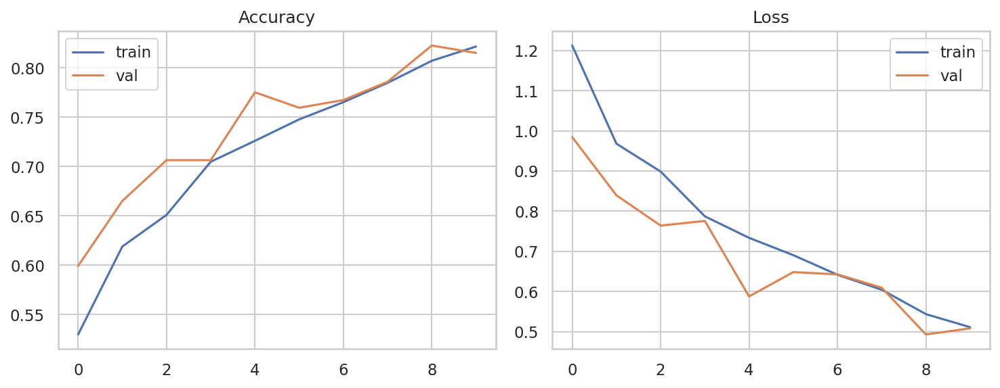
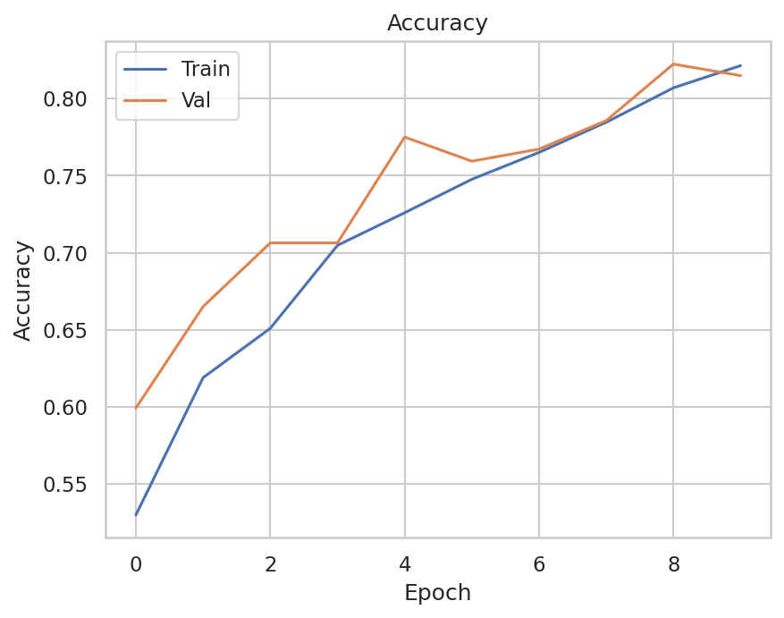
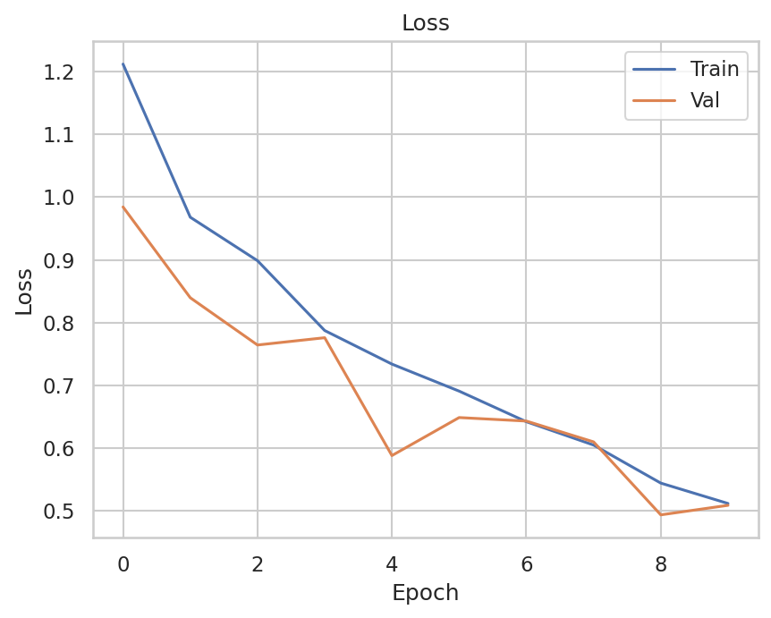
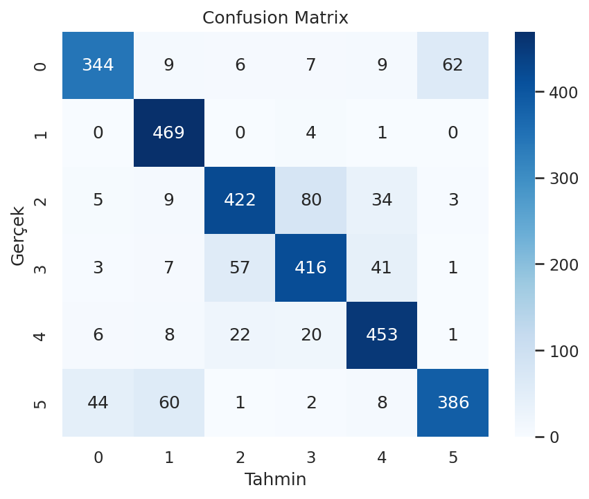
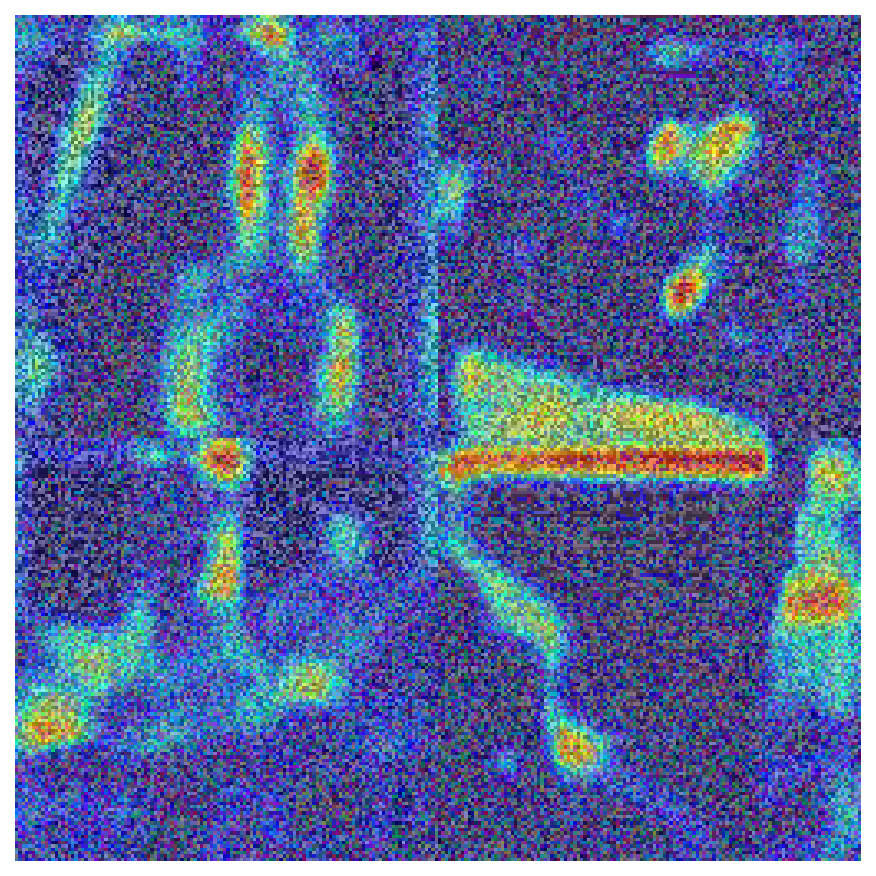

# Intel Image Classification — CNN

**Veri seti:** https://www.kaggle.com/datasets/puneet6060/intel-image-classification  
**Kaggle Notebook (public):** https://www.kaggle.com/code/ebruhattapolu/ebru-hattapo-lu 
**Çerçeve:** TensorFlow/Keras (GPU)

## Adımlar
- EDA (sınıf dağılımı, örnek görseller)
- Dataset: image_dataset_from_directory (train/val/test)
- Model: CNN + Data Augmentation
- Eğitim: EarlyStopping, ReduceLROnPlateau, ModelCheckpoint
- Değerlendirme: Accuracy/Loss grafikleri, Classification Report, Confusion Matrix
- Grad-CAM

### Eğitim Grafiği

### Accuracy Grafiği

### Loss Grafiği

### Confusion Matrix

### Grad-CAM (opsiyonel)

### Classification Report (metin)
👉 [classification_report.txt](classification_report.txt) dosyasına bakınız.
